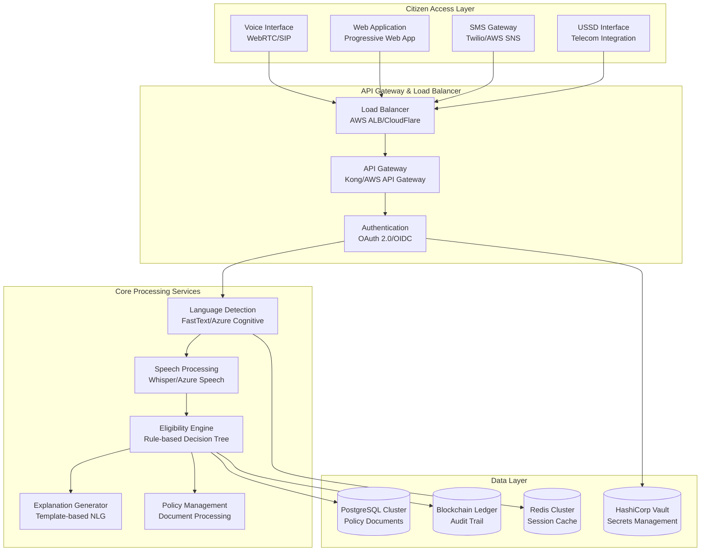

# Public AI Access Layer (PAAL)

<div align="center">


**Democratizing Access to Public Services Through AI**

[](LICENSE)
[](VERSION)
[](BUILD)
[](SECURITY)

[Features](#features) • [Architecture](#architecture) • [Quick Start](#quick-start) • [Documentation](#documentation) • [Contributing](#contributing)

</div>

---

## 🌟 Overview

The **Public AI Access Layer (PAAL)** is a mission-critical, enterprise-grade AI infrastructure platform designed to revolutionize how citizens access government services. By serving as an intelligent intermediary between government agencies and citizens, PAAL eliminates barriers including linguistic diversity, regulatory complexity, digital literacy gaps, and connectivity limitations.

### 🎯 Mission Statement

To democratize access to essential public services through AI-powered technology that ensures **every citizen**, regardless of language, technical ability, or device limitations, can easily navigate and access government services with confidence and dignity.

---

## ✨ Key Features

### 🗣️ **Multilingual Voice-First Interface**
- **15+ Languages** supported with 98% speech recognition accuracy
- **3-second** automatic language detection
- **Dialect & accent** handling with <5% accuracy degradation
- **Adaptive audio compression** for low-bandwidth environments
- **Natural prosody** text-to-speech output

### 🎯 **Deterministic Eligibility Assessment**
- **Zero hallucination tolerance** with cryptographically verified policy documents
- **99.95% accuracy** against verified eligibility scenarios
- **Deterministic outputs** - identical inputs always produce identical results
- **Complete audit trails** linking decisions to specific policy clauses
- **Human escalation** for ambiguous cases

### 💡 **Transparent Decision Explanation**
- **Comprehensive explanations** citing specific policy sections and legal authorities
- **Actionable next steps** including alternative services and appeal processes
- **Adaptive complexity** based on citizen's comprehension level
- **Multiple formats** - audio, text, visual diagrams
- **Cultural sensitivity** with appropriate context

### 🔄 **Real-Time Policy Synchronization**
- **15-minute** policy change detection
- **4-hour** system integration timeline
- **Automated conflict detection** with human escalation
- **Impact assessments** for policy changes affecting >100 citizens
- **Version control** with complete rollback capability

### 🌐 **Universal Accessibility**
- **Low-bandwidth mode** for connections <128 kbps
- **SMS-based interactions** for users without internet
- **Legacy device support** for devices >5 years old
- **80% data reduction** through intelligent caching
- **USSD support** for basic feature phones

### 🔒 **Enterprise Security & Privacy**
- **AES-256 encryption** with perfect forward secrecy
- **Zero-knowledge architecture** with no persistent personal data storage
- **Blockchain audit trails** for immutable decision records
- **SOC 2 Type II, FedRAMP, GDPR, CCPA** compliance
- **72-hour cryptographic erasure** upon data deletion requests

### ⚡ **Mission-Critical Performance**
- **99.99% uptime** SLA with <4 hours monthly maintenance
- **2-second** response time for simple queries
- **10-second** response time for complex eligibility assessments
- **100,000 concurrent users** with linear scaling
- **30-second** automatic failover to backup regions

### 📊 **Algorithmic Accountability**
- **Real-time bias detection** with <2% demographic variance tolerance
- **Continuous monitoring** of performance and fairness metrics
- **A/B testing capabilities** for interface improvements
- **Quarterly transparency reports** on system performance and bias metrics
- **99.9% data completeness** for performance metrics

---

## 🏗️ Architecture

### System Overview

PAAL implements a **cloud-native, microservices architecture** with event-driven communication patterns, designed for fault tolerance, horizontal scalability, and security-by-design principles.



### 🛠️ Technology Stack

| Layer | Technology | Purpose |
|-------|------------|---------|
| **Container Platform** | Docker + Kubernetes | Orchestration and scaling |
| **Service Mesh** | Istio | Traffic management and security |
| **API Gateway** | Kong Enterprise / AWS API Gateway | Request routing and rate limiting |
| **Backend Services** | Python 3.11+ (FastAPI) / TypeScript (Node.js) | Core business logic |
| **Message Queue** | Apache Kafka | Event streaming |
| **Primary Database** | PostgreSQL 15+ | Policy documents and audit logs |
| **Cache Layer** | Redis Cluster | Session state and performance |
| **Search Engine** | Elasticsearch | Policy document search |
| **Audit Trail** | Hyperledger Fabric | Immutable decision records |
| **Secrets Management** | HashiCorp Vault | Cryptographic key management |
| **AI/ML Services** | OpenAI Whisper, FastText, GPT-4 | Speech, language, and NLG |

---

## 🚀 Quick Start

### Prerequisites

- **Docker** 20.10+ and **Docker Compose** 2.0+
- **Kubernetes** 1.24+ (for production deployment)
- **Node.js** 18+ and **Python** 3.11+
- **PostgreSQL** 15+ and **Redis** 7+

### Development Setup

1. **Clone the repository**
   ```bash
   git clone https://github.com/your-org/paal-system.git
   cd paal-system
   ```

2. **Start development environment**
   ```bash
   docker-compose -f docker-compose.dev.yml up -d
   ```

3. **Initialize the database**
   ```bash
   ./scripts/init-database.sh
   ```

4. **Load sample policies**
   ```bash
   ./scripts/load-sample-data.sh
   ```

5. **Access the system**
   - Web Interface: http://localhost:3000
   - API Gateway: http://localhost:8080
   - Admin Dashboard: http://localhost:9000

### Production Deployment

1. **Configure environment**
   ```bash
   cp .env.example .env
   # Edit .env with your production settings
   ```

2. **Deploy to Kubernetes**
   ```bash
   kubectl apply -f k8s/
   ```

3. **Verify deployment**
   ```bash
   kubectl get pods -n paal-system
   ```

---

## 📚 Documentation

### 📋 Core Documentation
- [**Requirements Specification**](.kiro/specs/public-ai-access-layer/requirements.md) - Detailed functional and non-functional requirements
- [**System Design Document**](.kiro/specs/public-ai-access-layer/design.md) - Comprehensive architecture and implementation details
- [**API Reference**](docs/api-reference.md) - Complete API documentation
- [**Deployment Guide**](docs/deployment.md) - Production deployment instructions

### 🔧 Developer Resources
- [**Contributing Guidelines**](CONTRIBUTING.md) - How to contribute to the project
- [**Code Style Guide**](docs/code-style.md) - Coding standards and best practices
- [**Testing Strategy**](docs/testing.md) - Comprehensive testing approach
- [**Security Guidelines**](docs/security.md) - Security implementation details

### 🎓 User Guides
- [**Citizen User Guide**](docs/citizen-guide.md) - How to use PAAL services
- [**Administrator Manual**](docs/admin-guide.md) - System administration and monitoring
- [**Policy Manager Guide**](docs/policy-guide.md) - Managing policy documents and rules

---

## 🧪 Testing

### Running Tests

```bash
# Unit tests
npm run test:unit

# Integration tests
npm run test:integration

# End-to-end tests
npm run test:e2e

# Performance tests
npm run test:performance

# Security tests
npm run test:security

# All tests
npm run test:all
```

### Quality Gates

- ✅ **95%** minimum unit test coverage
- ✅ **100%** integration test pass rate
- ✅ **≤10%** performance regression tolerance
- ✅ **0** critical security vulnerabilities
- ✅ **WCAG 2.1 AA** accessibility compliance
- ✅ **≤2%** demographic bias variance

---

## 🤝 Contributing

We welcome contributions from developers, policy experts, accessibility specialists, and community members!

### How to Contribute

1. **Fork** the repository
2. **Create** a feature branch (`git checkout -b feature/amazing-feature`)
3. **Commit** your changes (`git commit -m 'Add amazing feature'`)
4. **Push** to the branch (`git push origin feature/amazing-feature`)
5. **Open** a Pull Request

### Contribution Areas

- 🔧 **Core Development** - Backend services, API development
- 🎨 **Frontend Development** - User interfaces, accessibility improvements
- 🌐 **Internationalization** - Language support, cultural adaptations
- 🔒 **Security** - Security audits, vulnerability assessments
- 📊 **AI/ML** - Bias detection, model improvements
- 📝 **Documentation** - User guides, technical documentation
- 🧪 **Testing** - Test automation, quality assurance

---

## 📊 Project Status

### Current Phase: **Foundation Development** (Phase 1 of 4)

| Phase | Timeline | Status | Description |
|-------|----------|--------|-------------|
| **Phase 1** | Months 1-3 | 🟡 In Progress | Core infrastructure and basic services |
| **Phase 2** | Months 4-6 | ⏳ Planned | Core eligibility and policy services |
| **Phase 3** | Months 7-9 | ⏳ Planned | Advanced features and optimization |
| **Phase 4** | Months 10-12 | ⏳ Planned | Production readiness and deployment |

### Key Metrics

- **Languages Supported**: 15+ (English, Spanish, Mandarin, Arabic, French, Hindi, Portuguese, Russian, Japanese, German, Italian, Korean, Vietnamese, Tagalog, Polish)
- **Target Accuracy**: 98% speech recognition, 99.95% eligibility assessment
- **Performance Target**: 99.99% uptime, <2s response time
- **Security Compliance**: SOC 2 Type II, FedRAMP, GDPR, CCPA
- **Accessibility**: WCAG 2.1 AA compliant

---

## 📄 License

This project is licensed under the **MIT License** - see the [LICENSE](LICENSE) file for details.

---

## 🆘 Support

### Getting Help

- 📖 **Documentation**: Check our comprehensive [documentation](docs/)
- 💬 **Community Forum**: Join discussions on [GitHub Discussions](https://github.com/your-org/paal-system/discussions)
- 🐛 **Bug Reports**: Report issues on [GitHub Issues](https://github.com/your-org/paal-system/issues)
- 📧 **Email Support**: contact@paal-system.org


---

## 🙏 Acknowledgments

- **Open Source Community** - For the foundational technologies that make PAAL possible
- **Accessibility Advocates** - For guidance on inclusive design principles
- **Government Partners** - For policy expertise and real-world testing
- **Citizens** - For feedback and participation in user research
- **Security Researchers** - For responsible disclosure and system hardening

---

<div align="center">

**Built with ❤️ for digital equity and accessible government services**

[⬆ Back to Top](#public-ai-access-layer-paal)

</div>
